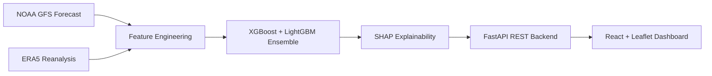

# 🌤️ AtmoTrust

**AI-Powered Forecast Bust Detection System**

*Smart India Hackathon (SIH) 2026 | Problem Statement: SIH26079 | Theme: Disaster Management*

---

## 📖 Overview

AtmoTrust is an intelligent forecast-confidence layer designed to predict **where and when medium-range numerical weather predictions (NWP) are likely to fail**. 

Rather than functioning as a standalone weather predictor, AtmoTrust acts as a "meta-model." It evaluates the output of existing weather models and scores their trustworthiness, providing forecasters with critical insights before they issue public warnings.

## ✨ What It Does

For any given forecast date and Indian Meteorological Department (IMD) region, AtmoTrust evaluates lead days 1–10 and provides:

- **Bust Probability:** The likelihood that the forecast error will exceed the region's 90th percentile threshold.
- **Confidence Score:** A straightforward metric representing model reliability (1 − bust probability).
- **Explainable AI Insights:** The top 3 meteorological reasons driving the confidence score, translated into plain English using SHAP values.
- **Forecaster Advisory:** Actionable recommendations tailored to the current confidence level.

---

## Architecture

Our pipeline combines powerful predictive models with real-world weather data to deliver real-time confidence scores.



*(Note: The mermaid chart will render beautifully on GitHub and other Markdown viewers)*

---

## Quickstart Guide

Get AtmoTrust running locally in a few simple steps.

### 1. Prerequisites
Ensure you have Python and Node.js installed.
```bash
# Install Python dependencies
pip install -r requirements.txt

# Configure environment variables
cp .env.example .env
```
*Note: Edit `.env` to add your Copernicus Climate Data Store (`CDS_KEY`) API key.*

### 2. Run the Data Pipeline

**Option A: Pilot Run (Fast)**  
Runs a quick test over 3 regions and 3 months.
```bash
python scripts/run_pipeline.py --mode pilot
```

**Option B: Full Dataset**  
Scales to process the complete historical dataset.
```bash
python scripts/run_pipeline.py --mode full --start 2021-06-01 --end 2023-09-30
```

### 3. Launch the Application

Start the backend API (FastAPI):
```bash
uvicorn api.main:app --host 0.0.0.0 --port 8000 --reload
# View interactive API docs at: http://localhost:8000/docs
```

Start the frontend dashboard (React):
```bash
cd frontend
npm install
npm run dev
# Open dashboard at: http://localhost:5173
```

*(Alternatively, use Docker for the full stack: `cd docker && docker-compose up --build`)*

---

## Data Sources

We integrate multiple high-quality datasets to train and validate our models:

| Source | Purpose | Access |
|--------|---------|--------|
| **NOAA GFS (0.25°)** | Primary NWP forecast input | Free (NOMADS / AWS Open Data) |
| **ERA5 Reanalysis** | Ground truth for calculating forecast errors | Free (Copernicus CDS account) |
| **India AI Kosh** | India-specific gridded datasets | Free (aikosh.indiaai.gov.in) |
| **IMD Bulletins** | Historical bust event identification | Publicly available reports |

---

## Key Features

### Adaptive Bust Thresholds
A "bust" is defined dynamically—it occurs when an error exceeds the **90th percentile of the regional and seasonal error distribution**. We don't use flat thresholds because a 30mm rainfall error in Kerala is routine, while the same error in Rajasthan is an extreme anomaly.

### Strict Time-Based Validation
All model evaluation employs chronological train/validation/test splits. We strictly avoid random row-level splitting to prevent data leakage and ensure our reported metrics reflect true real-world performance.

### Human-Readable Explanations
Using SHAP values, every prediction comes with a plain-English explanation. 
*Example:* 
> *"LOW confidence (34%): Driven by an unusually large 24-hour forecast change in rainfall, elevated low-level wind speeds suggesting an active monsoon surge, and a historically high bust frequency for this region and season at this lead time."*

---

## Model Performance

Our ensemble model is rigorously evaluated to ensure reliability:

| Metric | Score | Significance |
|--------|-------|--------------|
| **Brier Skill Score** | ~0.25 | Shows significant improvement over baseline climatology |
| **ROC-AUC** | ~0.75 | Strong overall discrimination ability |
| **PR-AUC** | ~0.38 | Effective bust detection despite heavily imbalanced data |
| **Reliability** | Calibrated | Predicted probabilities closely match observed frequencies |

---

## API Endpoints

The FastAPI backend exposes several clean, RESTful endpoints:

- `GET /health` : System health check
- `GET /regions` : List all supported IMD subdivisions
- `POST /forecast-confidence` : Get predictions for a specific region, date, and lead day
- `GET /forecast-confidence/{region}` : Get a 10-day confidence outlook for a region
- `GET /confidence-map/{date}` : Retrieve confidence data for all regions to populate the map view
- `GET /bust-events` : Fetch curated historical bust events for demonstrations
- `GET /model-info` : Access model metadata and evaluation metrics

---

## Demo Scenarios

We've curated specific historical events to demonstrate AtmoTrust's capabilities during critical weather anomalies:

| Date | Region | Meteorological Event |
|------|--------|----------------------|
| **2023-07-08** | Odisha | Depression BOB 02 — Model missed a 200mm/24h rainfall event |
| **2022-09-14** | Kerala | Active monsoon surge resulting in the Idukki extreme event |
| **2023-05-22** | Uttarakhand | Western Disturbance interaction missed by GFS (150mm event) |
| **2022-07-29** | Vidarbha | Monsoon trough bust — Forecast predicted 15mm, but 120mm fell |
| **2021-10-17** | AP Coast | Cyclone Gulab — Track error of 80km at a 48-hour lead time |

---

## Known Limitations

In the spirit of transparency, here are current system constraints:

1. **Latency:** ERA5 reanalysis data has a ~5-day latency. AtmoTrust is currently optimized for operational post-processing and near-real-time verification rather than true real-time forecasting.
2. **Single Model Input:** We currently only ingest GFS data. Incorporating ECMWF data would improve our ensemble spread features but requires institutional access.
3. **Pilot Scope:** The current pilot covers 5 key regions. Expanding to all 36 IMD subdivisions is technically straightforward but requires more data downloading time.
4. **Hackathon Prototype:** A full production deployment would necessitate an institutional data partnership with IMD for operational scheduling.

---

## Team

| Role | Responsibility |
|------|----------------|
| P1 — Data Lead | GFS + ERA5 pipeline, error computation |
| P2 — ML Lead | Model training, evaluation, SHAP |
| P3 — Backend Lead | FastAPI, inference endpoint |
| P4 — Frontend Lead | React dashboard, Leaflet map |
| P5 — DevOps + Eval | Docker, evaluation plots |
| P6 — Integration + Pitch | README, deck, demo rehearsal |